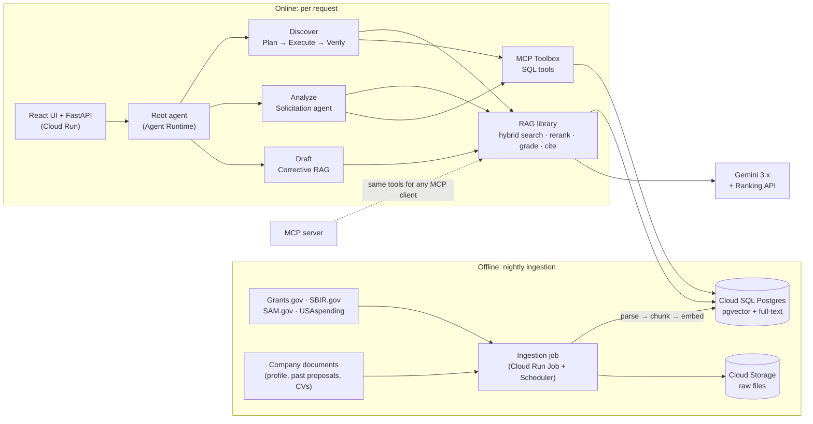
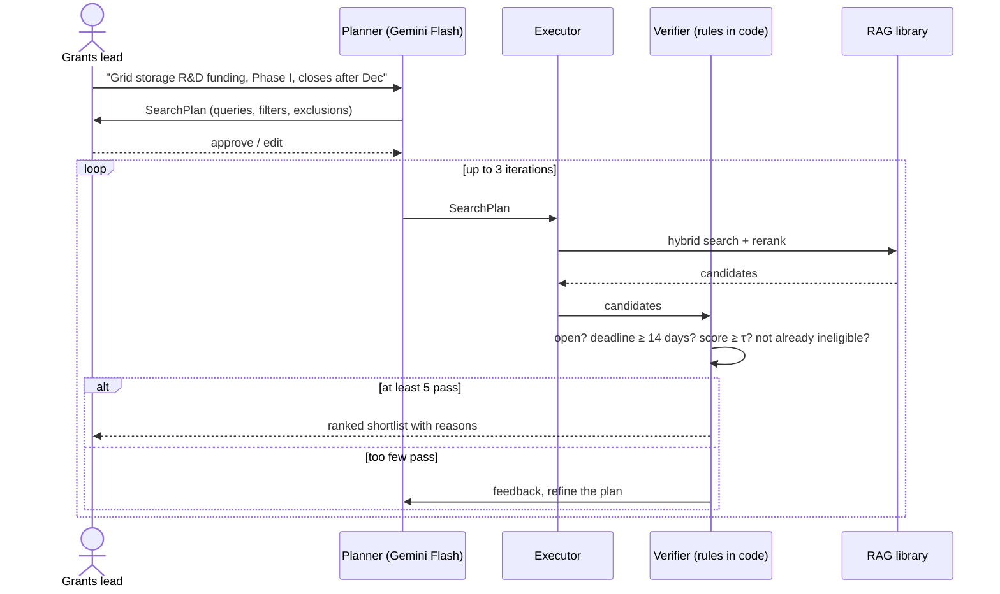
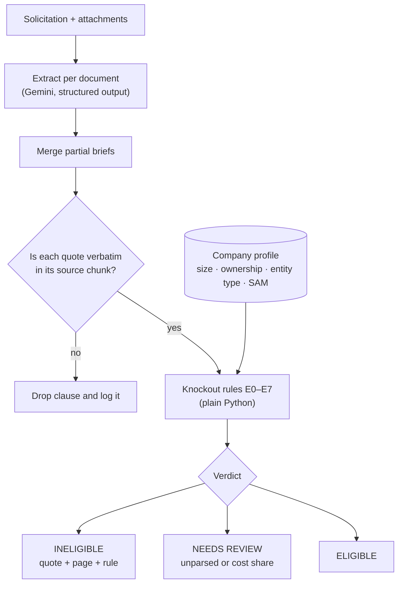
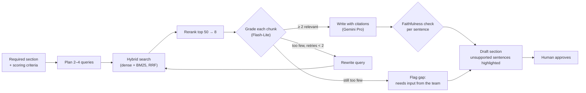
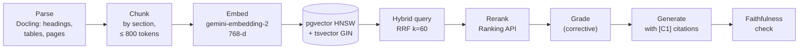
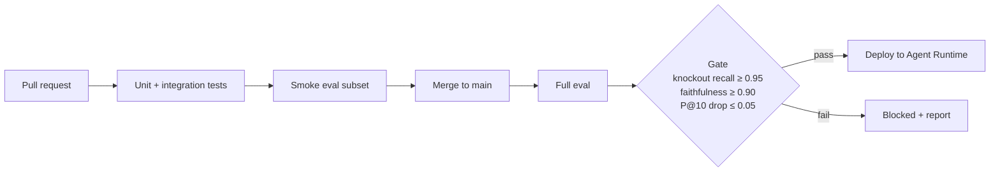

# grant-capture-agent

**Find federal funding a small R&D company can actually win, rule out the ones it can't, and draft the proposal from the company's own evidence.**


An open, measured take on the grant-capture workflow that commercial GovCon platforms sell. It uses multi-agent workflows on **Google ADK**, a **hand-built hybrid RAG pipeline**, **deterministic eligibility rules**, and **evaluation gates in CI**, and runs on **Gemini Enterprise Agent Platform**.

> **Status:** v1 is being built in public, milestone by milestone (see the [roadmap](#roadmap)). The first prototype is kept in [`legacy/`](legacy/). Every number in [Results](#results) will come from a reproducible eval. Until then it says *pending*.

---

## Contents

[The problem](#the-problem) · [What it does](#what-it-does) · [Architecture](#architecture) · [How each module works](#how-each-module-works) · [Evaluation](#evaluation) · [Results](#results) · [Tech stack](#tech-stack) · [Repository layout](#repository-layout) · [Getting started](#getting-started) · [Roadmap](#roadmap) · [Design docs](#design-docs)

---

## The problem

A grants lead at a 30-person deep-tech company does three jobs alone:

1. **Find:** search Grants.gov, SBIR.gov and SAM.gov, each with its own interface and vocabulary.
2. **Qualify:** read a 40-page solicitation, only to find a disqualifying clause on page 31.
3. **Draft:** write the technical section from old proposals scattered across shared drives.

One sentence can decide whether a week of writing is worth starting:

> *"Only small business concerns (SBCs) are eligible. An SBC must have 500 or fewer employees and be more than 50% owned and controlled by U.S. citizens or permanent resident aliens."*

## What it does

| Module | The user's question | What the system returns |
|---|---|---|
| **Discover** | "What open funding fits what we do?" | A ranked shortlist with the reason each one fits. A person approves the search plan first. |
| **Analyze** | "Can we even apply? What does it require?" | A one-page brief: eligibility, "shall" requirements, scoring criteria, page limits and deadlines. Plus an **eligible / ineligible / needs review** verdict that quotes the exact clause and page. |
| **Draft** | "Write our technical approach." | A cited draft of each required section, built only from the company's documents. Missing evidence is flagged, never invented. |

**Guardrails:** a person approves every plan and draft. Every verdict and claim cites its source. Eligibility is decided by code, not by the model. Nothing is ever submitted automatically.

---

## Architecture



**Design principles**

1. **The LLM extracts, rules decide.** Decisions with consequences (eligibility, the verifier's pass/fail) are plain Python with unit tests.
2. **Typed hand-offs.** Agents pass validated Pydantic objects (`SearchPlan`, `SolicitationBrief`, `DraftSection`), not free text.
3. **Quote, don't paraphrase.** Every extracted clause must appear verbatim in its source chunk, and this is checked in code.
4. **Fail toward review.** Uncertain means *needs review* or a flagged gap, never a confident guess.
5. **Measure before claiming.** Each module ships with its eval, and CI blocks regressions.

---

## How each module works

### Discover: Plan → Execute → Verify, with a human approval step



### Analyze: the Solicitation agent and knockout screen



### Draft: corrective RAG



### The RAG pipeline, end to end



---

## Evaluation

Every metric comes from labeled data in [`evals/`](evals/). The golden sets are labeled by hand and frozen, so they're never used for tuning.



| Golden set | Size | Measures |
|---|---|---|
| Knockout | ≥ 30 real solicitations | Knockout recall and precision |
| Requirements | 10 solicitations | Requirement extraction recall |
| Discover queries | 20 queries | Precision@10, nDCG@10 |
| Draft sections | 9 sections | Context relevance, faithfulness |
| Red team | 20 documents with injected instructions | Prompt-injection resistance |
| Timing benchmark | 10 search + 3 drafting tasks | Time saved vs. manual (single-user study, raw times published) |

## Results

| Metric | Target | Measured |
|---|---|---|
| Knockout recall / precision | ≥ 0.95 / ≥ 0.85 | *pending (M1)* |
| Requirement extraction recall | ≥ 0.85 | *pending (M1)* |
| Discover precision@10 | ≥ 0.70 | *pending (M2)* |
| Time to qualified shortlist vs. manual | ≥ 50% faster | *pending (M2)* |
| Draft context relevance / faithfulness | ≥ 0.60 / ≥ 0.90 | *pending (M3)* |
| Time to first draft vs. manual | ≥ 40% faster | *pending (M3)* |
| Cost per full run · p95 latency | < $0.25 · < 90 s | *pending (M4)* |

---

## Tech stack

| Layer | Choice | Why |
|---|---|---|
| Agents | **Google ADK 2.x** workflow graphs | Loops, branches and resumable human approval in one graph |
| Lifecycle | **agents-cli** | Google's standard scaffold → eval → deploy → CI/CD toolchain |
| Models | **Gemini 3.8 Flash · 3.5 Flash-Lite · 3.1 Pro** via `google-genai` | Model size matched to each job: extraction, grading, drafting |
| Embeddings | **gemini-embedding-2** (768-d) | Strong retrieval with a small index |
| Store | **Cloud SQL Postgres + pgvector** | Metadata, full-text and vectors in one database; hybrid search in one SQL query |
| Parsing | **Docling**, with Gemini multimodal as the fallback | Keeps headings, tables and page numbers for citations |
| Reranking | **Vertex AI Ranking API** | Precise top-k after a broad hybrid recall |
| Tools | **MCP Toolbox for Databases** + a custom **MCP server** | Safe SQL tools; the same capabilities from any MCP client |
| Agent protocols | **A2A** between the orchestrator and the Analyze agent · **MCP** for tools | Analyze runs as an independent service that other agents can call |
| Serving | **Agent Runtime** (formerly Agent Engine) · **FastAPI + React** on **Cloud Run** | Managed agent hosting with sessions |
| Memory | **Agent Platform Sessions + Memory Bank** | Remembers a company's preferences (excluded agencies, award ranges) across sessions |
| Governance | **Agent Identity · Agent Registry · Agent Gateway · Model Armor** | Each agent has its own identity and permissions; tool traffic is routed through a policy gateway; prompt-injection screening |
| Data protection | **Sensitive Data Protection** · **OAuth 2.0** (Auth Manager) | PII is redacted from company documents before indexing; drafts are exported to Google Docs only with the user's consent |
| Evaluation | **ADK evalsets · Gen AI evaluation service · custom autoraters** | Tool-path, response and retrieval quality, run continuously |
| Ops | **Terraform · GitHub Actions (WIF) · Cloud Trace · Cloud Logging · BigQuery Agent Analytics · Secret Manager** | Reproducible infrastructure, keyless CI, traced and analyzable runs |
| Specialization | **Vertex AI supervised tuning** | Tuned vs. prompted grader, decided by measurement |

---

## Repository layout

```
app/          ADK agents: discover/, analyze/, draft/, rules/, tools/, contracts.py
rag/          hand-built RAG library (no framework dependency)
ingest/       source adapters + nightly pipeline
db/           SQLAlchemy models + Alembic migrations
mcp_server/   MCP server (search, brief, eligibility)
toolbox/      MCP Toolbox for Databases config
api/  web/    FastAPI backend + React UI
evals/        golden + dev sets, metrics, ADK evalsets, reports
data/company/ synthetic company: "Lumen Grid Labs"
deploy/       Terraform + CI/CD
docs/         PRD, system design, ADRs, plans, reports, guide
legacy/       v0 prototype (Nov–Dec 2025)
```

*Directories are added milestone by milestone. Today the repo contains `docs/` and `legacy/`.*

## Getting started

Setup instructions arrive with milestone **M0**. They'll cover local Postgres in Docker, `agents-cli playground`, the ingestion command and running the evals.

## Roadmap

- [ ] **M0 Foundation:** scaffold, synthetic company data, Postgres schema, ingestion, CI, eval harness, ADRs
- [ ] **M1 Analyze:** parsing and chunking, Solicitation agent, knockout rules, hand-labeled golden sets
- [ ] **M2 Discover:** hybrid search + rerank, PEV workflow with approval, timing benchmark
- [ ] **M3 Draft:** corrective RAG, calibrated grader, faithfulness check, MCP server
- [ ] **M4 Ship:** Agent Runtime + Cloud Run, Terraform, tracing, CI eval gate, red team, eval report
- [ ] **M5 Specialize:** fine-tuned grader vs. prompted grader; multimodal parsing vs. Docling

## Design docs

| Document | What's in it |
|---|---|
| [PRD](docs/product/PRD.md) | Problem, user, stories, metrics, scope, comparison with commercial tools |
| [System design](docs/design/system-design.md) | Data model, contracts, workflows, rules, evals, security, deployment |
| [Project guide](docs/guide/project-guide.html) | Plain-language walkthrough of the whole build |
| [Legacy v0](legacy/README.md) | What the first prototype did and why it was rebuilt |

## Acknowledgements

Data: [Simpler Grants API](https://wiki.simpler.grants.gov/product/api), [SBIR.gov](https://www.sbir.gov/), [SAM.gov](https://sam.gov/), [USAspending](https://www.usaspending.gov/). The company used in examples and evals (*Lumen Grid Labs*) is fictional.

## Author

**Karthick Balaje**: AI engineer building agents that are evaluated before they ship.
[LinkedIn](https://linkedin.com/in/karthickbalajege) · [Medium](https://medium.com/@karthickbalaje01) · [GitHub](https://github.com/kb2326)
