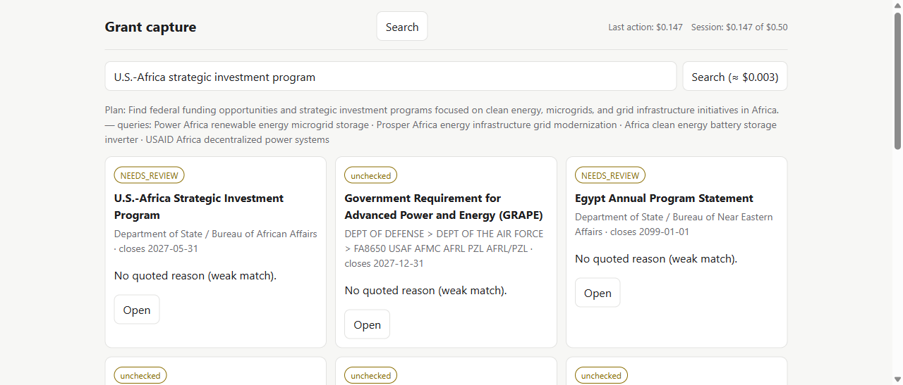
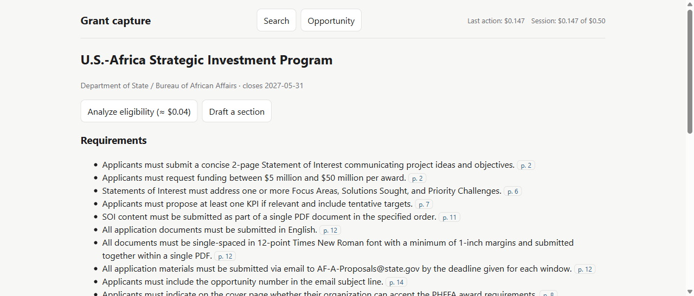
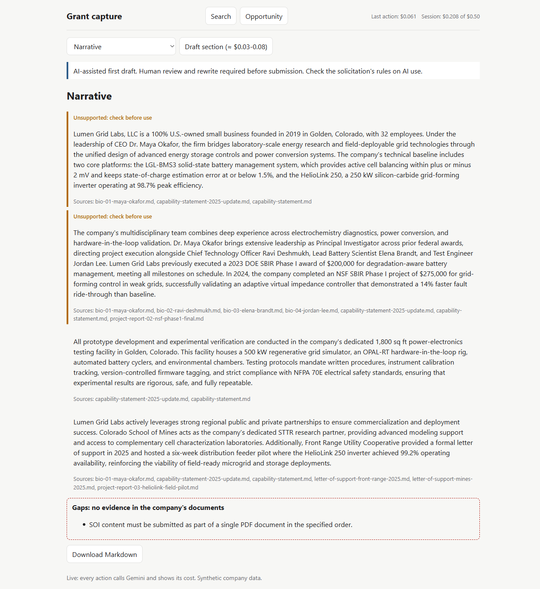
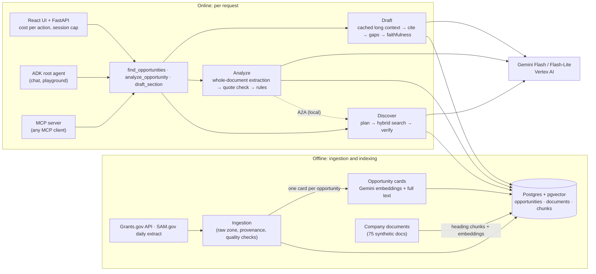

# grant-capture-agent

**Find federal funding a small R&D company can actually win, rule out the ones it can't, and draft the proposal from the company's own evidence.**


A measured, open build of the grant-capture workflow: multi-agent workflows on **Google ADK**, a **hand-built hybrid retrieval pipeline**, **eligibility decided by plain-Python rules**, and an **evaluation for every design choice**. Each module was built twice, a simple baseline and a richer variant, and the measurements decided which one ships.

> **What is real here.** Everything under [Results](#results) was measured on real Grants.gov and SAM.gov solicitations and a synthetic company, with the reports in [`reports/`](reports/). Some labels come from an AI reviewer (marked *silver*); the drafting ground truth is scored by code, and the evidence grader was checked against hand labels. The production deployment is **designed and validated with `terraform plan`, but not deployed**, to keep spending near zero ([ADR-0021](docs/adr/0021-deployment-designed-not-executed.md)).

---

[The problem](#the-problem) · [What it does](#what-it-does) · [Architecture](#architecture) · [Built by ablation](#built-by-ablation) · [Results](#results) · [How it would ship](#how-it-would-ship) · [Cost](#cost-honesty) · [Getting started](#getting-started) · [Repository](#repository-layout) · [Roadmap](#roadmap)

---

## The problem

A grants lead at a 30-person deep-tech company does three jobs alone:

1. **Find:** search Grants.gov and SAM.gov, each with its own interface and vocabulary.
2. **Qualify:** read a 40-page solicitation, only to find a disqualifying clause on page 31.
3. **Draft:** write the technical section from old proposals scattered across shared drives.

One sentence can decide whether a week of writing is worth starting:

> *"Only small business concerns (SBCs) are eligible. An SBC must have 500 or fewer employees and be more than 50% owned and controlled by U.S. citizens or permanent resident aliens."*

## What it does

| | Search | Analyze | Draft |
|---|---|---|---|
| The question | "What open funding fits what we do?" | "Can we even apply? What does it require?" | "Write our technical approach." |
| The answer | Ranked opportunities from 2,737 indexed notices, with the search plan shown | Eligible / ineligible / needs review, quoting the deciding clause and page; requirements, criteria, sections and deadlines, each with its page; any **AI-use rules** in the solicitation | A first draft citing the company's own documents, **gaps** where it has no evidence, unsupported sentences flagged, and an AI-use notice first |





*The local UI (React + FastAPI) running live against the real agents. Every action shows its cost; a session cap stops spending at $0.50.*

**Guardrails:** eligibility is decided by code, never by the model; every quote is checked to appear verbatim on its cited page; drafts list gaps instead of inventing evidence; every draft starts with "AI-assisted first draft. Human review and rewrite required before submission."; nothing is ever submitted automatically.

---

## Architecture



**Design principles**
1. **The model extracts, rules decide.** Eligibility and verification are plain Python with unit tests ([ADR-0006](docs/adr/0006-llm-extracts-rules-decide.md)).
2. **Typed hand-offs.** Components pass validated Pydantic objects (`SearchPlan`, `SolicitationBrief`, `DraftSection`), not free text.
3. **Quote, don't paraphrase.** Every extracted clause must appear verbatim on its cited page, checked in code.
4. **Fail toward review.** Uncertain means *needs review* or a flagged gap, never a confident guess.
5. **Measure before claiming, and let the measurement choose the architecture.**

## Built by ablation

Each workflow was built as a simple baseline (B0) and a richer variant (B1), and both ran on the same evaluation. The richer one was kept only if it won by a set margin without doubling cost or latency.

| Module | B0 (simple) | B1 (richer) | What the numbers said | Kept |
|---|---|---|---|---|
| **Analyze** ([ADR-0016](docs/adr/0016-analyze-long-context.md)) | read each whole document | 5-page windows, merged | eligibility: B0 as good or better at a quarter of the cost; requirement lists: windows found 0.69 vs 0.15 | **B0** for eligibility; windows planned for requirements |
| **Discover: embeddings** ([ADR-0020](docs/adr/0020-embedding-choice.md)) | local EmbeddingGemma 2 (free) | `gemini-embedding-001` | nDCG@10 0.514 vs 0.472 (local better on vague requests) | **Gemini** (directional) |
| **Discover: rerank** | hybrid search only | + Vertex Ranking API | 0.514 vs 0.512: no gain | **off** |
| **Discover: workflow** ([ADR-0017](docs/adr/0017-discover-architecture-by-ablation.md)) | single pass | Plan → Execute → Verify loop | the loop refined 0 of 15 times: its count-based check never failed on a 2,700-row index | **inconclusive**, B0 default |
| **Draft** ([ADR-0018](docs/adr/0018-draft-architecture-by-ablation.md)) | whole corpus in a cached context | corrective RAG (retrieve, grade, rewrite, gap) | both flagged 10/10 true gaps; B0 more faithful (0.83 vs 0.78), fewer outdated citations (1.4% vs 3.5%), 2x faster | **B0** |

Two lessons: **the simple baseline won or tied every time** at this scale, and **one evaluation found a bug in our own rules, not the model** (a bulleted list of eligible applicant types was read as several "only X may apply" rules; fixing it took knockout precision from 0.45 to 0.91).

## Results

| Metric | Target | Measured |
|---|---|---|
| Knockout recall / precision | ≥ 0.95 / ≥ 0.85 | **1.00 / 0.91** on 40 solicitations (10 knockouts) · silver labels |
| Requirement extraction recall | ≥ 0.85 | **0.15** whole document; **0.69** page windows (n=7) · not met |
| Discover precision@10 | ≥ 0.70 | **0.50** (nDCG@10 0.46) · 15 queries, silver labels · not met |
| Draft gap detection | flag, never invent | **10 of 10 true gaps flagged, 0 invented** · 12 controlled tasks, scored by code |
| Draft faithfulness | ≥ 0.90 | **0.83** (silver judge) · not met |
| Evidence grader vs. hand labels | κ ≥ 0.6 | **κ 0.63** (40 pairs labeled by hand) |
| Cost per action | — | search $0.003 · analyze $0.04 · draft $0.04-0.08 |
| Latency (p50) | — | search 11 s · analyze 61 s · draft 41 s |

Full reports: [M1 Analyze](reports/m1/ablation.md) · [M2 Discover](reports/m2/ablation.md) · [M3 Draft](reports/m3/ablation.md).

**Evaluation honesty.** *Silver* labels come from a different, stronger AI model than the system's, with its own prompt; read them as agreement with an AI reviewer. The drafting ground truth is exact: the synthetic corpus was generated from a checked-in plan whose required phrases prove each requirement, with 10 deliberate gaps no document mentions and 15 outdated "trap" documents. The grader that decides relevance in corrective RAG was checked against 40 hand labels.

## How it would ship

Designed to production standard, proven without spending, and stopped there ([ADR-0021](docs/adr/0021-deployment-designed-not-executed.md)):

- **Target:** Cloud Run (API + UI, scale to zero) → Agent Runtime (root agent, and Analyze as its own A2A service) → Cloud SQL Postgres + pgvector (off until needed); Secret Manager; one service account per agent; Cloud Trace; a budget alert.
- **Proven:** the production Terraform passes `validate` and `plan` (9 resources to add, nothing created; [evidence](docs/deploy/evidence/terraform-plan.txt)); the production image builds and serves the UI locally ([`Dockerfile.api`](Dockerfile.api)); the deploy workflow exists but is disabled.
- **Learn it:** [prototype to production](docs/deploy/01-prototype-to-production.md) · [architecture](docs/deploy/02-architecture.md) · [runbook](docs/deploy/03-runbook.md) · [costs](docs/deploy/04-costs.md) · [teardown](docs/deploy/05-teardown.md).

## Cost honesty

The whole project ran on a personal Google Cloud project with a $10/month target.

| Milestone | Gemini spend | What drove it |
|---|---|---|
| M1 Analyze | ≈ $8.60 | AI labeling with a Pro model; page-window ablation |
| M2 Discover | ≈ $1.02 | planning calls, embeddings (local embeddings ran on a free Kaggle GPU) |
| M3 Draft | ≈ $1.6-2.0 | Flash "thinking" tokens in long-context drafting |
| M4 (UI, deploy design) | ≈ $0.23 | one live UI session |

October went over the target. What changed in the code because of it: thinking tokens are capped for drafting, every evaluation stage has a hard dollar cap that counts failed calls, the UI has a session cap, and expensive checks are explicit priced buttons rather than side effects. A budget alert only sends email; caps in code are what stop spend.

## Getting started

Local only: everything runs on a laptop with Docker; Gemini calls go to your own Google Cloud project.

```bash
cp .env.example .env                 # API keys for Simpler Grants and SAM.gov (free)
docker compose up -d db              # Postgres 16 + pgvector on localhost:5433
uv sync && uv run alembic upgrade head
uv run python -m ingest seed-company
uv run python -m ingest run --source grants_gov --limit 200
uv run python -m rag build-cards && uv run python -m rag embed --model gemini --max-usd 0.50
uv run python -m ingest.company_corpus load
uv run pytest tests/unit tests/db && uv run python -m evals.run --suite smoke

# the product UI (live: each action shows its cost)
uv run uvicorn api.main:app --host 127.0.0.1 --port 8080
cd web && npm install && npm run dev  # http://127.0.0.1:5173

# or chat with the agent / use it from any MCP client
agents-cli playground
uv run python -m mcp_server          # registered as "grant-capture" in .mcp.json
```

## Repository layout

```
app/          ADK agents and services: analyze/, discover/, draft/, rules/, contracts.py
rag/          hand-built retrieval: cards, embeddings, hybrid search (RRF), rerank, chunk search
ingest/       Grants.gov + SAM.gov adapters, raw zone, parsing, company corpus
db/           SQLAlchemy models + Alembic migrations
api/  web/    product API (FastAPI) + UI (React, Vite, TypeScript)
mcp_server/   MCP server: search, brief, eligibility, drafting
evals/        golden + dev sets, metrics, ablation runners, labeling pages
data/company/ the synthetic company "Lumen Grid Labs" (75 documents + corpus plan)
deployment/   Terraform: foundation (applied in M0) and prod (planned, not applied)
docs/         system design, specs, plans, ADRs, deploy guides, writing, project guide
reports/      measured ablation reports per milestone
legacy/       v0 prototype
```

## Roadmap

- [x] **M0 Foundation:** scaffold, synthetic company, Postgres schema, ingestion with provenance, CI, eval harness, ADRs, Terraform foundation
- [x] **M1 Analyze:** whole-document vs. page-window extraction, quote verification, knockout rules E0-E7 ([report](reports/m1/ablation.md))
- [x] **M2 Discover:** opportunity cards, hybrid search, three ablations, ADK 2 workflow with plan approval, Analyze over local A2A, remembered preferences ([report](reports/m2/ablation.md))
- [x] **M3 Draft:** 75-document corpus with traps, long context vs. corrective RAG, grader calibrated against hand labels, AI-use notice and clauses, MCP server ([report](reports/m3/ablation.md))
- [x] **M4 Ship (free part):** local live UI, production deployment designed and validated (not deployed), cloud spending stopped
- [ ] **M4b (funded):** deploy following the runbook; Memory Bank, Model Armor, red-team run, CI eval gate on a live deployment
- [ ] **M5 Specialize:** tuned vs. prompted grader; multimodal parsing; managed retrieval comparison

## Design docs

| Document | What's in it |
|---|---|
| [System design](docs/design/system-design.md) | Data model, contracts, workflows, rules, evals, security, deployment |
| Specs | [M1](docs/design/m1-analyze-spec.md) · [M2](docs/design/m2-discover-spec.md) · [M3](docs/design/m3-draft-spec.md) · [M4](docs/design/m4-ship-spec.md) |
| [ADRs](docs/adr/README.md) | Every architecture decision, with the measured outcome |
| [How it would ship](docs/deploy/01-prototype-to-production.md) | Prototype → production, runbook, costs, teardown |
| [Project guide](docs/guide/project-guide.html) | Plain-language walkthrough of the whole build |

## Acknowledgements

Data: [Simpler Grants API](https://wiki.simpler.grants.gov/product/api), [SAM.gov](https://sam.gov/). Opportunity fields follow the [CommonGrants](https://wiki.simpler.grants.gov/product/deliverables/specifications/grants-protocol) protocol. The company used in examples and evals (*Lumen Grid Labs*) and all its documents are fictional.

## Author

**Karthick Balaje**: AI engineer building agents that are evaluated before they ship.
[LinkedIn](https://linkedin.com/in/karthickbalajege) · [Medium](https://medium.com/@karthickbalaje01) · [GitHub](https://github.com/kb2326)
