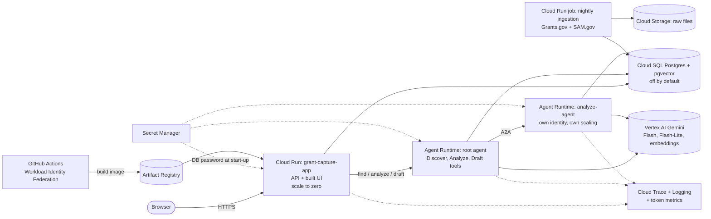

# 2. Production architecture

This is how the system would run on Google Cloud. Nothing here is deployed (ADR-0021); the runtime layer is written in [`deployment/terraform/prod/`](../../deployment/terraform/prod/) and proven with `terraform plan`, and the shared foundation (buckets, image registry, secrets, CI identity, optional Cloud SQL) is in [`deployment/terraform/foundation/`](../../deployment/terraform/foundation/).

## Local component → production counterpart

| Local (what we built and measured) | Production | Defined in |
|---|---|---|
| `uv run uvicorn api.main:app` + `npm run dev` | Cloud Run service `grant-capture-app` serving API and built UI from one image (`Dockerfile.api`), min 0 / max 2 instances | `prod/main.tf` |
| `agents-cli playground` (root agent) | Agent Runtime deployment of the root agent, identity `root-agent` | `prod/main.tf` (identity, roles); `agents-cli deploy` (runtime) |
| `uvicorn app.analyze.a2a_app:a2a_app` (local A2A) | Agent Runtime deployment of Analyze as its own A2A service, identity `analyze-agent` | same |
| Docker Postgres 16 + pgvector | Cloud SQL Postgres + pgvector, smallest tier, `enable_cloudsql=false` until needed | `foundation/cloudsql.tf` |
| `.env` | Secret Manager (`db-app-password`, `sam-api-key`, `simpler-grants-api-key`) | `foundation/main.tf` |
| `python -m ingest` by hand | Cloud Run job + Cloud Scheduler (paused by default) | `foundation/ingest_job.tf` |
| Our cost counters + Cloud Monitoring | Cloud Trace, Logging, token-count charts, budget alert | built in; `prod/main.tf` (`create_budget`) |
| `pytest` + smoke suites | GitHub Actions CI on every PR (already running) + a manual, disabled deploy workflow | `.github/workflows/` |

## Identities and what each may do

| Identity | Roles | Why |
|---|---|---|
| `api` (foundation account, roles granted in `prod/main.tf`) | Vertex AI user; Cloud SQL client; Cloud Trace agent; read `db-app-password`; read the raw bucket | serves the UI and runs the tools in-process (Gemini, database, documents) |
| `root-agent` | Vertex AI user; Cloud Trace agent; read `db-app-password` | runs the chat agent and its tools |
| `analyze-agent` | Vertex AI user; Cloud Trace agent; read `db-app-password` | Analyze as an independent service (ADR-0013, ADR-0014) |
| `ingest` (foundation) | Cloud SQL client; write the raw bucket; read the source API keys | nightly data load |
| `ci` (foundation) | push to Artifact Registry, via Workload Identity Federation only | builds images, never touches data |

Each agent having its own identity means a permission can be granted or removed for one agent without touching the others, which is the point of per-agent identity (ADR-0014). A funded next step would add a principal access boundary policy and route agent-to-tool traffic through Agent Gateway with Model Armor screening.

## Request path, end to end
1. The browser loads the UI from Cloud Run (static files from the same container).
2. "Search" posts to `/api/discover`; the API calls the root agent's Discover service, which embeds the query, runs hybrid search in Cloud SQL, verifies, and returns cards with costs.
3. "Analyze" calls Analyze (over A2A in production), which reads the solicitation documents, extracts a brief with verified quotes and lets the plain-Python rules decide eligibility.
4. "Draft" loads the brief, puts the company corpus in a Gemini context cache, drafts the section with citations, lists gaps, judges faithfulness, and returns the draft with the AI-use notice first.
5. Every step is traced; every Gemini call is counted in Cloud Monitoring; the session cap refuses calls past the budget.
